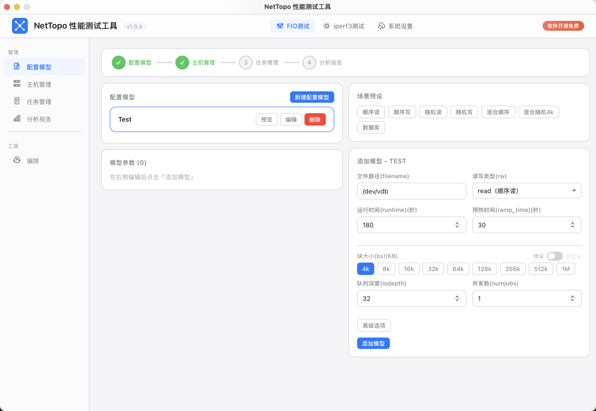
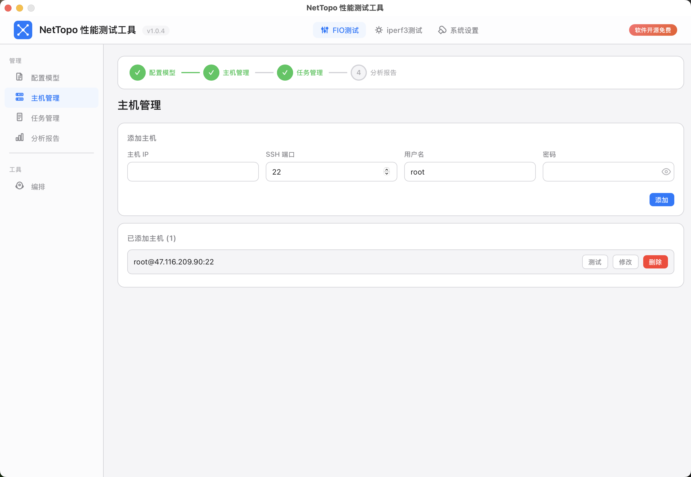
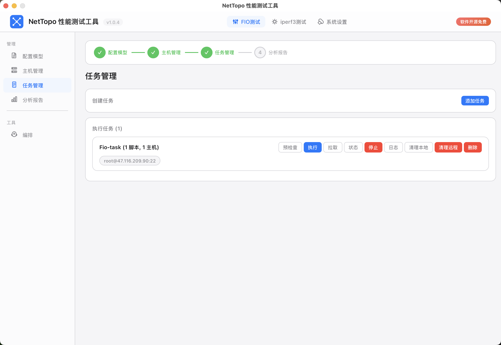
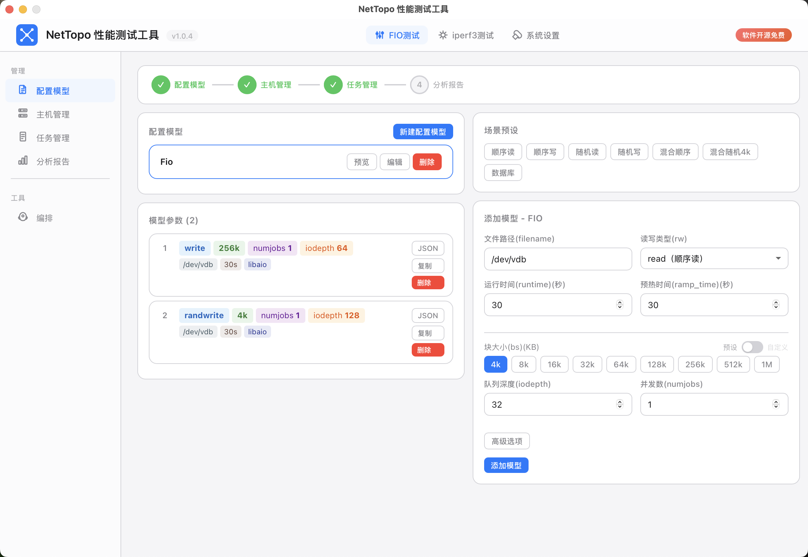
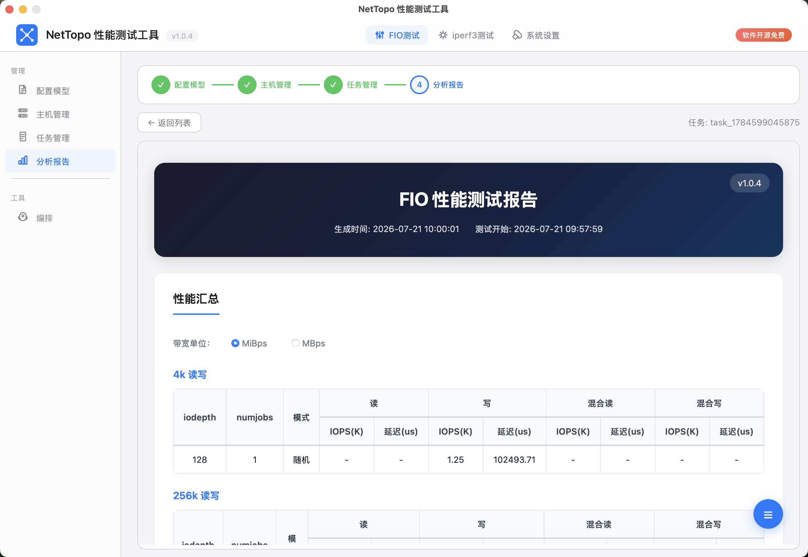
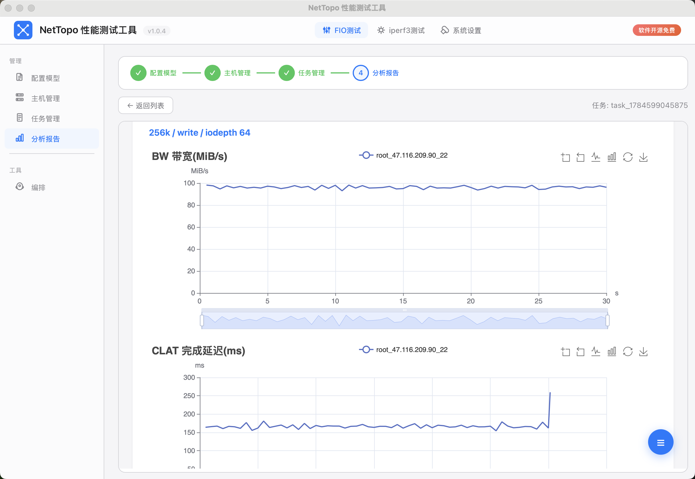

# NetTopo パフォーマンステストツール

[](/LICENSE)
[](https://github.com/760985933/NetTopo_Performance_Test/releases/latest)
[](https://go.dev/)
[](https://goreportcard.com/report/github.com/760985933/NetTopo_Performance_Test)
[](https://wails.io)

[English](README.md) | [中文](README_ZH.md) | **日本語**

NetTopo はネットワークトポロジのパフォーマンステスト管理およびレポート生成ツールで、CLI、Web、デスクトップ GUI の3つのモードをサポートしています。

## 機能

- **FIO 設定ジェネレーター** — FIO テストパラメータのビジュアルエディタ、`.fio` スクリプトを自動生成
- **リモートタスク実行** — SSH 経由で FIO テストを一括デプロイ、実行、監視
- **自動データ取得** — テスト完了後、全ノードの結果データをワンクリックでダウンロード
- **スマートレポート生成** — Excel サマリー + インタラクティブ HTML チャートレポートを自動生成
- **タスクオーケストレーション** — ドラッグ＆ドロップで複数シナリオを並べ替え、自動順次実行

## スクリーンショット

| メインUI | ホスト管理 | タスク管理 |
|---------|-----------|-----------|
|  |  |  |

| スクリプト設定 | レポート (1) | レポート (2) |
|---------------|------------|------------|
|  |  |  |

## クイックスタート

### 方法1：デスクトップアプリ（推奨）

[Releases](../../releases) ページからお使いのプラットフォーム用アプリをダウンロードし、ダブルクリックで実行します。

| プラットフォーム | ファイル |
|----------|------|
| macOS (Universal) | `nettopo_test_macos_universal.zip` |
| Windows | `nettopo_test_windows_amd64.zip` |
| Linux | `nettopo_test_linux_amd64.zip` |

### 方法2：CLI モード

```bash
# プラットフォームに応じた ZIP パッケージをダウンロードして実行：
# Linux:   nettopo_test_cli_linux_amd64.zip
# macOS:   nettopo_test_cli_darwin_amd64.zip または nettopo_test_cli_darwin_arm64.zip
# Windows: nettopo_test_cli_windows_amd64.zip

# FIO データを分析してレポートを生成
./nettopo_test_cli -data /path/to/fio/data -output-dir ./output

# Web 管理インターフェースを起動
./nettopo_test_cli -web -port 8080
```

### 方法3：ソースからビルド

```bash
# CLI モード
go build -o nettopo_test_cli ./cmd/cli/

# デスクトップモード（Wails CLI と Node.js が必要）
go install github.com/wailsapp/wails/v2/cmd/wails@latest
cd frontend && npm install && cd ..
wails build
```

## プロジェクト構造

```
fio-go/
├── cmd/cli/              # CLI エントリーポイント
├── main.go               # Wails デスクトップエントリーポイント
├── internal/
│   ├── app/              # Wails バインディング
│   ├── executor/         # SSH/FIO リモート実行
│   ├── models/           # データモデル
│   ├── parser/           # JSON/ログ解析
│   ├── report/           # Excel/HTML レポート生成
│   └── web/              # Web モードサーバー
├── frontend/             # React デスクトップ UI
├── build/                # ビルド設定
├── scripts/              # FIO スクリプト
└── wails.json            # Wails 設定
```

## 使用方法

### 1. FIO データの準備

FIO テストの JSON ファイルとログファイルを以下の構造で整理します：

```
data/
├── 192.168.1.100/        # ノードごとのディレクトリ
│   ├── system.txt        # システム情報
│   └── logs/             # FIO ログファイル
└── 192.168.1.101/
    ├── system.txt
    └── logs/
```

### 2. レポート生成

```bash
./nettopo_test_cli -data ./data -output-dir ./output
```

生成ファイル：
- `output/fio_summary.xlsx` — Excel サマリー（ノード詳細、パフォーマンス概要、統合ビュー）
- `output/fio_report.html` — インタラクティブ HTML レポート（ECharts 時系列チャート付き）

### 3. リモート実行（Web/デスクトップモード）

1. FIO テストパラメータを設定
2. ターゲットホストを追加（SSH 接続情報）
3. 「デプロイ＆実行」をクリックしてスクリプトをプッシュし、テストを自動開始
4. テスト完了後、「データ取得」をクリックして結果をダウンロード
5. 「レポート生成」をクリックして分析・レポートを作成

## 必要要件

- Go 1.25+
- Node.js 20+（デスクトップモードのコンパイルのみ）
- FIO（テスト実行マシンのみ）
- SSH アクセス（リモート実行のみ）

## ライセンス

AGPLv3

このプロジェクトは GNU Affero General Public License v3.0 (AGPLv3) の下でライセンスされています。

**主要要件：**

- このプロジェクトをベースにした派生作品がネットワークサービスを提供する場合や、ソフトウェアを配布する場合、**フロントエンドとバックエンドの完全なソースコードを公開する必要があります**。
- 派生作品には、フロントエンドページ、バックエンドサービス、API ロジック、データベーススクリプト、デプロイスクリプトが含まれますが、これらはすべて完全にオープンソース化する必要があります。
- サーバー実装を非公開にしたままフロントエンドコードのみを公開することはできません。
